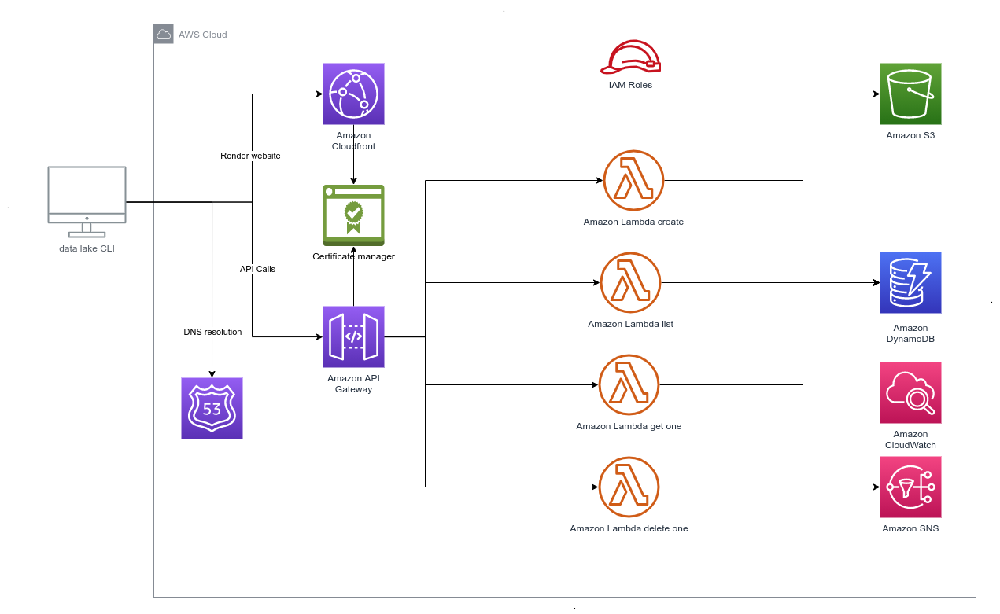
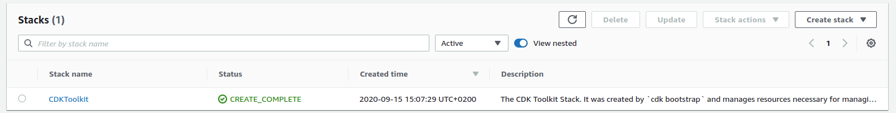
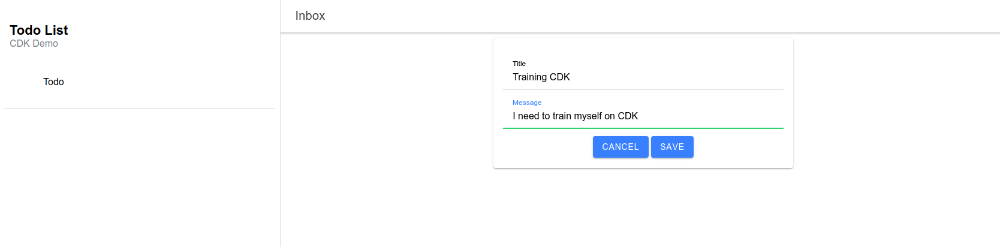
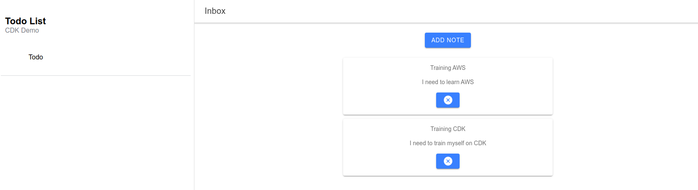

# Deploy highly available multi-tiers website using AWS CDK

## Introduction

Infrastructure as Code became key enabler for companies that need:

- Standardised deployment
- Automated disaster recovery 
- Infrastructure audit

However it can be very scary as it changes the paradigm, from a fully manual process to an entire automated one. In addition the learning curve on new language such as as HCL (for Terraform) can be a blocker. We can as well talk about lack of unit testing (even if it is feasible it is not always simple).

> Why couldn't I code my infrastructure in my preferred language ?

[AWS CDK](https://docs.aws.amazon.com/cdk/latest/guide/home.html) (AWS Cloud Development Kit) proposes a new approach for infrastructure as code. The goal is to provide to developers libraries in their preferred language to deploy their infrastructure.

Let's take an example of an instance `t2.micro` with typescript language:

```typescript
const instance = new ec2.Instance(this, 'TestInstance', {
    vpc,
    instanceName: `my-instance`,
    instanceType: ec2.InstanceType.of(ec2.InstanceClass.T2, ec2.InstanceSize.MICRO),
    machineImage: ec2.MachineImage.latestAmazonLinux(),
    securityGroup: securityGroupInstance,
    keyName: `my-ssh-key`, 
});
```

CDK supports: TypeScript, JavaScript, Python, Java, and C#/.Net

In this article I will guide you how help you to deploy an Highly available multi-tiers application with CDK.

Our project will be a Todo list.

We will deploy:

- An [Ionic](https://ionicframework.com/) frontend (based on Angular)
- Typescript [AWS Lambda](https://aws.amazon.com/fr/lambda/) functions for backend
- An [AWS DynamoDB](https://aws.amazon.com/fr/dynamodb/) for data retention
- An [AWS SNS](https://aws.amazon.com/fr/sns/) topic for task deletion notification

You will see the following notion:

- [Route 53](https://aws.amazon.com/fr/route53/) for domain names
- [S3](https://aws.amazon.com/fr/s3/) / [Cloudfront](https://aws.amazon.com/fr/cloudfront/) for Frontend
- [Lambda](https://aws.amazon.com/fr/lambda/) functions / [APIGateway](https://aws.amazon.com/fr/api-gateway/) v2 for backend
- [DynamoDB](https://aws.amazon.com/fr/dynamodb/) for data retention
- [SNS](https://aws.amazon.com/fr/sns/) for notification
- [Cloudformation](https://aws.amazon.com/fr/cloudformation/) for deployment

As all my article are supposed to be production we need to consider following points:

Security:

- Add encryption in transit with [AWS Certificate manager](https://aws.amazon.com/fr/certificate-manager/)
- Add encryption at rest using [AWS KMS](https://aws.amazon.com/fr/kms/) on bucket and DynamoDB
- Use dedicated [execution roles](https://docs.aws.amazon.com/lambda/latest/dg/lambda-intro-execution-role.html) per functions to access to DynamoDB (Read, ReadWrite) / publish to SNS topics
- Add [CORS](https://developer.mozilla.org/fr/docs/Web/HTTP/CORS) on apigateway
- Use [OAI](https://docs.aws.amazon.com/AmazonCloudFront/latest/DeveloperGuide/private-content-restricting-access-to-s3.html) to prevent direct access to S3 bucket

Availability:

- Lambda functions are serverless so highly available
- DynamoDB is an highly available database
- Have generic stack to deploy easily in multi region
- Add a Geo restriction to your region 

Cost optimization:

- Serverless: Pay only what you consume
- Large free plan for ApiGateway, SNS, Lambda and DynamoDB



## Application

### Introduction

First we need to create our application. Here is what we would like to do:

- Create a task
- List tasks
- Get a single task
- Delete a task. When a task is effectively deleted we want to receive an email notification

### API

A task will be defined with:

- title: A string
- message: A string

```json
{
    "id": "string generated during store",
    "title": "string",
    "message": "string"
} 
```

We will have 4 Endpoints in Json:

```bash
POST /todo
{
    "title": "string",
    "message": "string"
}
-- 201 
{
    "id": "string"
    "title": "string",
    "message": "string"
}
```

```bash
GET /todo
-- 200
[
    {
        "id": "string",
        "title": "string",
        "message": "string"
    },
    {
        "id": "string",
        "title": "string",
        "message": "string"
    }
]
```

```bash
GET /todo/${id}
-- 200
{
    "id": "string"
    "title": "string",
    "message": "string"
}
```

```bash
DELETE /todo/${id}
-- 204
```

### Backend

Our backend will be composed of 4 lambda functions:

- `create.ts`: Creates a Todo
- `list.ts`: List Todo
- `get-one.ts`: Get One Todo
- `delete-one.ts`: Delete one Todo

Let's start with the package.json

```json
{
  "name": "cdk-demo-backend",
  "version": "1.0.0",
  "description": "The CDK demo backend",
  "main": "index.js",
  "scripts": {
    "build": "rm -rf lib && tsc",
    "function:deploy": ""
  },
  "dependencies": {},
  "devDependencies": {
    "@types/aws-lambda": "8.10.72",
    "@types/node": "^10.17.0",
    "@types/uuid": "7.0.3",
    "aws-sdk": "2.865.0",
    "eslint": "^6.6.0",
    "ts-loader": "^5.3.3",
    "tslint": "^5.20.0",
    "tslint-config-airbnb": "^5.11.2",
    "typescript": "~3.8.3",
    "webpack": "^4.29.0"
  },
  "author": "Geoffrey Muselli",
  "license": "ISC"
}
```

We need to create the model:

```typescript
export interface Todo {
    id?: string;
    title: string;
    message: string;
}

export interface TodoError {
    error: string;
}
```

The `create.ts`:

```typescript
import { APIGatewayProxyEventV2, APIGatewayProxyResultV2 } from "aws-lambda";
import * as AWS from 'aws-sdk';
import { Todo } from './model/todo';

const https = require('https');

const db = new AWS.DynamoDB.DocumentClient({
  httpOptions: {
    agent: https.Agent({
      rejectUnauthorized: true,
      secureProtocol: "TLSv1_method",
      ciphers: "ALL"
    })
  },
  maxRetries: 3,
  region: process.env.AWS_REGION
});

const TABLE_NAME = process.env.TABLE_NAME || '';

const generateId = () => {
  let result = '';
  const characters = 'ABCDEFGHIJKLMNOPQRSTUVWXYZabcdefghijklmnopqrstuvwxyz0123456789';
  for (var i = 0; i < 20; i++) {
    result += characters.charAt(Math.floor(Math.random() * characters.length));
  }
  return result;
}

export const handler = async (event: APIGatewayProxyEventV2): Promise<APIGatewayProxyResultV2> => {

  if (!event.body) {
    return {
      statusCode: 400,
      body: JSON.stringify({
        error: 'bad_request',
        detail: 'Empty body'
      }),
      headers: {
        'content-type': 'application/json'
      }
    };
  }
  const todo = (typeof event.body == 'object' ? event.body : JSON.parse(event.body)) as Todo;

  if (!todo.title || !todo.message) {
    return {
      statusCode: 400,
      body: JSON.stringify({
        error: 'bad_request',
        detail: 'Please provide title and message'
      }),
      headers: {
        'content-type': 'application/json'
      }
    };
  };

  // generate the id
  todo.id = generateId();

  const params = {
    TableName: TABLE_NAME,
    Item: todo
  };

  try {
    await db.put(params).promise();
    return {
      statusCode: 201,
      body: JSON.stringify(todo),
      headers: {
        'content-type': 'application/json'
      }
    };
  } catch (dbError) {
    return {
      statusCode: 500,
      body: JSON.stringify({
        error: 'server_error',
        detail: 'An internal server error occured. Please retry'
      }),
      headers: {
        'content-type': 'application/json'
      }
    };
  }
};
```

The `list.ts`:

```typescript
import * as AWS from 'aws-sdk';
import { APIGatewayProxyResultV2 } from "aws-lambda";

const db = new AWS.DynamoDB.DocumentClient();
const TABLE_NAME = process.env.TABLE_NAME || '';

export const handler = async (): Promise<APIGatewayProxyResultV2> => {

  const params = {
    TableName: TABLE_NAME
  };

  try {
    const response = await db.scan(params).promise();
    return {
      statusCode: 200,
      body: JSON.stringify(response.Items),
      headers: {
        'content-type': 'application/json'
      }
    };
  } catch (dbError) {
    return {
      statusCode: 500,
      body: JSON.stringify(dbError),
      headers: {
        'content-type': 'application/json'
      }
    };
  }
};
```

The `get-one.ts`:

```typescript
import * as AWS from 'aws-sdk';
import { APIGatewayProxyEventV2, APIGatewayProxyResultV2 } from "aws-lambda";

const db = new AWS.DynamoDB.DocumentClient();

const TABLE_NAME = process.env.TABLE_NAME || '';

export const handler = async (event: APIGatewayProxyEventV2): Promise<APIGatewayProxyResultV2> => {

  const id = event.pathParameters?.id;

  if (!id) {
    return {
      statusCode: 400,
      body: JSON.stringify({
        error: 'bad_request',
        detail: 'No todo id'
      }),
      headers: {
        'content-type': 'application/json'
      }
    };
  }

  const params = {
    TableName: TABLE_NAME,
    Key: {
      id
    }
  };

  try {
    const response = await db.get(params).promise();

    if (!response.Item) {
      return {
        statusCode: 404,
        body: JSON.stringify({
          error: 'not_found',
          detail: `No todo found for id "${id}"`,
        }),
        headers: {
          'content-type': 'application/json'
        }
      };
    }

    return {
      statusCode: 200,
      body: JSON.stringify(response.Item),
      headers: {
        'content-type': 'application/json'
      }
    };
  } catch (dbError) {
    return { 
      statusCode: 500, 
      body: JSON.stringify(dbError),
      headers: {
        'content-type': 'application/json'
      }
    };
  }
};
```

The `delete-one.ts`:

```typescript
import * as AWS from 'aws-sdk';
import { APIGatewayProxyEventV2, APIGatewayProxyResultV2 } from "aws-lambda";

const db = new AWS.DynamoDB.DocumentClient();

const sns = new AWS.SNS({ region: process.env.AWS_REGION });

const TABLE_NAME = process.env.TABLE_NAME || '';
const REPORT_TOPIC_ARN = process.env.REPORT_TOPIC_ARN || '';

export const handler = async (event: APIGatewayProxyEventV2): Promise<APIGatewayProxyResultV2> => {

    const id = event.pathParameters?.id;

    if (!id) {
        return {
            statusCode: 400,
            body: JSON.stringify({
                error: 'bad_request',
                detail: 'No todo id'
            }),
            headers: {
              'content-type': 'application/json'
            }
        };
    }

    const params = {
        TableName: TABLE_NAME,
        Key: {
            id
        }
    };

    try {
        const response = await db.get(params).promise();

        // directly return item
        if (!response.Item) {
            return {
                statusCode: 204,
                body: '',
                headers: {
                  'content-type': 'application/json'
                }
            };
        }

        await db.delete(params).promise();

        await sendNotification(response.Item.title)

        return {
            statusCode: 204,
            body: '',
            headers: {
              'content-type': 'application/json'
            }
        };
    } catch (dbError) {
        return {
            statusCode: 500,
            body: JSON.stringify(dbError),
            headers: {
              'content-type': 'application/json'
            }
        };
    }
};

const sendNotification = async (title: string): Promise<void> => {
    return new Promise<void>((resolve) => {
        sns.publish({ 
            TopicArn: REPORT_TOPIC_ARN, 
            Subject: 'Todo Deleted',
            Message: `Todo with title "${title}" has been deleted` 
        }, (error, response) => {
            if(error) {
                console.error('Error caught during notification', error);
            }
            if(response) {
                console.log(`Notification sent. MessageId = ${response.MessageId}, SequenceNumber = ${response.SequenceNumber}`);
            }
            resolve();
        });
    })
    
}
```

### Frontend

Our Frontend will be an Ionic App. You need first to download Ionic.

You need first to install Ionic:

```
npm install -g @ionic/cli
```

Then now let's create our application:

```
~/project/article-cdk$ ionic start

Pick a framework! 😁

Please select the JavaScript framework to use for your new app. To bypass this prompt next time, supply a value for the
--type option.

? Framework: Angular

Every great app needs a name! 😍

Please enter the full name of your app. You can change this at any time. To bypass this prompt next time, supply name,
the first argument to ionic start.

? Project name: frontend

Let's pick the perfect starter template! 💪

Starter templates are ready-to-go Ionic apps that come packed with everything you need to build your app. To bypass this
prompt next time, supply template, the second argument to ionic start.

? Starter template: 
  tabs         | A starting project with a simple tabbed interface 
❯ sidemenu     | A starting project with a side menu with navigation in the content area 
  blank        | A blank starter project 
  list         | A starting project with a list 
  my-first-app | An example application that builds a camera with gallery 
  conference   | A kitchen-sink application that shows off all Ionic has to offer
```

Now let's start coding. We will start with the definition of the model:

```typescript
export interface Todo {
  id?: string;
  title: string;
  message: string;
}

export interface TodoError {
  error: string;
}
```

We have our model. We can now create our `TodoService`:

```typescript
import { Injectable } from "@angular/core";
import { HttpClient } from '@angular/common/http';
import { Todo } from "src/app/model/todo";
import { environment } from "src/environments/environment";

@Injectable({ providedIn: 'root'})
export class TodoService {

  constructor(private http: HttpClient) { }

  public async findAll(): Promise<Array<Todo>> {
    return this.http.get<Array<Todo>>(`${environment.apiUrl}/todo`).toPromise();
  }

  public async findOne(name: string): Promise<Todo> {
    return this.http.get<Todo>(`${environment.apiUrl}/todo/${name}`).toPromise();
  }

  public async deleteOne(name: string): Promise<void> {
    this.http.delete(`${environment.apiUrl}/todo/${name}`).toPromise();
  }

  public async addOne(todo: Todo): Promise<Todo> {
    return this.http.post<Todo>(`${environment.apiUrl}/todo`, todo).toPromise();
  }
}

```

As you can see we are using `apiUrl` from environment:

```typescript
export const environment = {
  production: false,
  apiUrl: 'http://localhost:8080'
};
```

We need as well to create an `environment.prod.ts` and add our domain which will be pointing to our backend:

```typescript
export const environment = {
  production: false,
  apiUrl: 'https://api.my-domain.com'
};
```

We will now create our component and inject our `TodoService` to call the different APIs.

```typescript
import { Component, OnInit } from '@angular/core';
import { FormBuilder, FormControl, FormGroup, Validators } from '@angular/forms';
import { ActivatedRoute } from '@angular/router';
import { Todo } from '../model/todo';
import { TodoService } from './services/todo.service';

@Component({
  selector: 'app-folder',
  templateUrl: './folder.page.html',
  styleUrls: ['./folder.page.scss'],
})
export class FolderPage implements OnInit {

  public folder: string;

  public newNote: FormGroup;

  public todoList = new Array<Todo>();

  constructor(private activatedRoute: ActivatedRoute,
              private todoService: TodoService,
              private formBuilder: FormBuilder) { }

  async ngOnInit() {
    this.folder = this.activatedRoute.snapshot.paramMap.get('id');
    this.todoList = await this.todoService.findAll();
  }

  addNote() {
    if (this.newNote) {
      return;
    }
    this.newNote = this.formBuilder.group({
      title: new FormControl('', Validators.required),
      message: new FormControl('', Validators.required),
    });
  }

  async deleteNote(id: string) {
    await this.todoService.deleteOne(id);
    this.todoList = this.todoList.filter(todo => todo.id != id);
  }

  async saveNote() {
    const todo = await this.todoService.addOne({ title: this.newNote.get('title').value, message: this.newNote.get('message').value});
    this.todoList.push(todo);
    this.newNote = null;
  }
}
```

Now we have 2 parts in our component. 

One to list the notes:

```html
<ion-card *ngFor="let todo of todoList" class="todo">
    <ion-card-header>
    <ion-card-subtitle>{{ todo.title }}</ion-card-subtitle>
    </ion-card-header>

    <ion-card-content>
    <div style="width: 100%; margin-bottom: 10px;">
        {{ todo.message }}
    </div>
    <ion-button (click)="deleteNote(todo.id)">
        <ion-icon slot="icon-only" name="close-circle"></ion-icon>
    </ion-button>
    </ion-card-content>
</ion-card>
```

One to create the note:

```html
<div id="todo-header" *ngIf="!newNote">
    <ion-button (click)="addNote()" class="m-3">Add note</ion-button>
</div>

<div id="add-note" *ngIf="newNote">
    <ion-card class="todo">
    <ion-card-content>
        <form [formGroup]="newNote">
        <ion-list>
            <ion-item mode="md">
            <ion-label position="floating">Title</ion-label>
            <ion-input type="text" formControlName="title" required></ion-input>
            </ion-item>
            <ion-item mode="md">
            <ion-label position="floating">Message</ion-label>
            <ion-input type="text" formControlName="message" required></ion-input>
            </ion-item>
        </ion-list>
        <ion-button (click)="newNote = null" class="m-3">Cancel</ion-button>
        <ion-button (click)="saveNote()" [disabled]="!newNote.valid" class="m-3">Save</ion-button>
        </form>
    </ion-card-content>
    </ion-card>
</div>
```

Now our frontend is ready we can go through the deployment

## Deployment

In this section we will proceed to the deployment of your application with AWS CDK.

### Prerequisites

Before starting you need to install AWS CDK:

```
npm install -g aws-cdk
```

CDK for AWS is based on [Cloudformation](https://aws.amazon.com/fr/cloudformation/) you need to be familiar with the notion of [Stacks](https://docs.aws.amazon.com/AWSCloudFormation/latest/UserGuide/stacks.html). 

#### Domain name on route 53

You need to have a domain name on route 53 and configure an hosted zone: https://docs.aws.amazon.com/Route53/latest/DeveloperGuide/dns-configuring.html

#### Create deployment project

Let's create our project.

```
mkdir deployment
cdk init app --language=typescript
```

We need as well the following dependencies:

```json
    "@aws-cdk/core": "~1.93.0",
    "@aws-cdk/aws-certificatemanager": "~1.93.0",
    "@aws-cdk/aws-route53": "~1.93.0",
    "@aws-cdk/aws-route53-targets": "~1.93.0",
    "@aws-cdk/aws-s3": "~1.93.0",
    "@aws-cdk/aws-cloudfront": "~1.93.0",
    "@aws-cdk/aws-s3-deployment": "~1.93.0",
    "@aws-cdk/aws-apigatewayv2": "~1.93.0",
    "@aws-cdk/aws-apigatewayv2-integrations": "~1.93.0",
    "@aws-cdk/aws-dynamodb": "~1.93.0",
    "@aws-cdk/aws-logs": "~1.93.0",
    "@aws-cdk/aws-lambda": "~1.93.0",
    "@aws-cdk/aws-kms": "~1.93.0",
    "@aws-cdk/aws-iam": "~1.93.0",
    "@aws-cdk/aws-sns": "~1.93.0",
    "@aws-cdk/aws-sns-subscriptions": "~1.93.0",
    "@types/node": "^10.17.0",
    "eslint": "^6.6.0",
    "ts-loader": "^5.3.3",
    "tslint": "^5.20.0",
    "tslint-config-airbnb": "^5.11.2",
    "typescript": "~3.8.3",
    "webpack": "^4.29.0"
```

#### Bootsrap CDK

You need to install CDK Toolkit on your region. To do this you need to run following command:

```
cdk bootstrap aws://<account-id>/<region>
```

Example:

```
cdk bootstrap aws://123456789012/<eu-west-3>
```

Then if you go in your region:

For more information about bootstraping you can read [this guide](https://docs.aws.amazon.com/cdk/latest/guide/bootstrapping.html)




#### Root configuration

To make something generic we will create a a root configuration containing all the shared information

- `accountId`: The accountId that will be used to deploy with cdk. You can use following command: `aws sts get-caller-identity`
- `appName`: The name of your application
- `email`: The email on which you want to be notified for task deletion
- `domainHostedZoneId`: The ID of your route 53 hosted zone
- `domainHostedZoneName`: The name of your route 53 hosted zone (your root domain name)

This will be formatted as a Json object 

Example: 

```json
{
    "accountId" : "123456789012",
    "appName" : "cdk-demo-speedflyer",
    "email": "my@email.com",
    "domainHostedZoneId" : "AAAAAAAAAAAAAAAAAAAAA",
    "domainHostedZoneName" : "my-domain.com"
}
```

Put this config in `deployment/config/global.json`

#### Define region

To be able to deploy to several region we will add in our configuration an list of region on their configuration.

To define a region we will create a `Region` object:

`deployment/model/region.ts`

```typescript
export class Region {
    id: string;
    awsRegion: string;
    domain: string;
    geoRestrictions: string[]
}
```

Then in create a config in `deployment/config/regions.json` and add the parameters for each region you want to deploy:

Here is an example of a region `fr` deployed on `eu-west-3`.

```json
[
    {
        "id": "fr",
        "awsRegion": "eu-west-3",
        "domain": "fr.my-domain.com",
        "geoRestrictions": [ "FR" ]
    }
]
```

### Application deployment

#### Preriquisites

We will now proceed to application deployment.

Before deploying our application we need to:

- Build the Functions bundle
- Build the Angular bundle

To build the Docker image:

```
$ cd ../backend
$ npm run build
$ cd ../deployment
$ mkdir -p bundle/backend
$ cp -r ../backend/lib/* bundle/backend
```

To build the Angular bundle simply do:

```
$ cd ../frontend
$ npm run build-prod
$ cd ../deployment
$ mkdir -p bundle/frontend
$ cp -r ../frontend/www/* bundle/frontend
```

#### Database

Create a database is pretty simple with cdk:

```typescript
createDynamoDB() {
    return new dynamodb.Table(this, 'TodoList', {
        tableName: 'TodoList',
        partitionKey: { name: 'id', type: dynamodb.AttributeType.STRING },
        encryption: dynamodb.TableEncryption.AWS_MANAGED,
    });
}
```

> We will see the permissions later

#### SNS

To create the SNS topic and the email subscription

```typescript
createReportSNSTopic(region: Region) {
    const myTopic = new sns.Topic(this, 'ReportTopic',
        {
            topicName: `${global.appName}-report-${region.id}`,
        });
    myTopic.addSubscription(new snsSubscription.EmailSubscription(`${global.email}`));
    return myTopic;
}
```

> We will see the permissions later

#### UI

Now let's start with UI deployment.

As a reminder we will use an S3 bucket to store the website content and cloudfront as [CDN](https://en.wikipedia.org/wiki/Content_delivery_network).

First let's create the s3 bucket and add the results of the Angular build as source asset:

```typescript
/**
 * Create bucket
 *
 * @param region: the region on which to deploy
 */
createBucket(region: Region): s3.IBucket {

  const bucket = new s3.Bucket(this, `websiteBucket`, {
      removalPolicy: cdk.RemovalPolicy.DESTROY,
      websiteIndexDocument: 'index.html',
      bucketName: `${global.appName}-website-${region.id}`
  });

  // add bucket deployment
  new s3Deployment.BucketDeployment(this, `websiteBucketDeployment`, {
      // target from built directory
      sources: [s3Deployment.Source.asset('bundle/frontend')],
      destinationBucket: bucket
  });

  return bucket;
}
```

Let's create the frontend certificate to enforce HTTPS. We will use as domain:
- `www.${region.domain}`
- `${region.domain}`

> The certificate must be created on `us-east-1` for cloudfront distribution

```typescript
const frontendCertificate = new acm.DnsValidatedCertificate(this, `FrontendCertificate`, {
    domainName: region.domain,
    region: 'us-east-1',
    hostedZone: hostedZone,
    validation: acm.CertificateValidation.fromDns(hostedZone),
    subjectAlternativeNames: [`www.${region.domain}`],
});
```

We will use an OAI (Origin Access Identity) to prevent S3 direct access:

```typescript
const oai = new cloudfront.OriginAccessIdentity(this, `OAI`);

bucket.grantRead(oai); 
```

Now our OAI and certificates are created we can process to the Cloudfront distribution creation.

- We will configure the different erros such as 404 or 403 to redirect to the index.html (this is the equivalent of the Nginx `try_uri`)
- We will add a georestriction to `fr` (this is not mandatory. Just to show you how to do it)

```typescript
createCloudFrontDistribution(region: Region, hostedZone: route53.IHostedZone, bucket: s3.IBucket) {
  // create the frontend certificate
  // for cloudfront needs to create certificate in us-east-1
  const frontendCertificate = new acm.DnsValidatedCertificate(this, `FrontendCertificate`, {
      domainName: region.domain,
      region: 'us-east-1',
      hostedZone: hostedZone,
      validation: acm.CertificateValidation.fromDns(hostedZone),
      subjectAlternativeNames: [`www.${region.domain}`],
  });
  
  // creates the OAI so that only cloudfront can access the S3 bucket
  const oai = new cloudfront.OriginAccessIdentity(this, `OAI`);

  bucket.grantRead(oai); 

  const distribution = new cloudfront.CloudFrontWebDistribution(this, `Distribution`, {
      originConfigs: [
          {
              behaviors: [{ isDefaultBehavior: true }],
              s3OriginSource: {
                  s3BucketSource: bucket,
                  originAccessIdentity: oai,
              },
          }
      ],
      // this add the redirect rule ton index.html in case the 403 or 404 are caught
      errorConfigurations: [
          {
              errorCode: 403,
              responseCode: 200,
              responsePagePath: '/index.html',
          },
          {
              errorCode: 404,
              responseCode: 200,
              responsePagePath: '/index.html'
          }
      ],
      viewerCertificate: cloudfront.ViewerCertificate.fromAcmCertificate(
          frontendCertificate,
          {
              aliases: [ region.domain, `www.${region.domain}`],
              securityPolicy: cloudfront.SecurityPolicyProtocol.TLS_V1,
              sslMethod: cloudfront.SSLMethod.SNI
          }),
      geoRestriction: {
          locations: region.geoRestrictions,
          restrictionType: 'whitelist',
      }
  });

  // Ouput backend host url
  new cdk.CfnOutput(this, 'SiteUrl', {
      value: `https://${region.domain}`,
      description: `The website url. You can access your website  https://${region.domain}`
  });

  // Ouput backend host url
  new cdk.CfnOutput(this, 'WWWSiteURL', {
      value: `https://www.${region.domain}`,
      description: `The www website url. You can access your website  https://www.${region.domain}`
  });
}
```
> Cloudfront distribution deployment might take time

#### Backend

Let first create our Lambda functions:

```typescript
const createOneFunction = new lambda.Function(this, 'createOneFunction', {
    code: new lambda.AssetCode('bundle/backend'),
    functionName: `${global.appName}-${region.id}-create`,
    handler: 'create.handler',
    runtime: lambda.Runtime.NODEJS_14_X,
    environment: {
        TABLE_NAME: dynamoDB.tableName,
    },
    memorySize: 512
});

const listFunction = new lambda.Function(this, 'listFunction', {
    code: new lambda.AssetCode('bundle/backend'),
    functionName: `${global.appName}-${region.id}-list`,
    handler: 'list.handler',
    runtime: lambda.Runtime.NODEJS_14_X,
    environment: {
        TABLE_NAME: dynamoDB.tableName,
    },
    memorySize: 256
});

const getOneFunction = new lambda.Function(this, 'getOneFunction', {
    code: new lambda.AssetCode('bundle/backend'),
    functionName: `${global.appName}-${region.id}-get-one`,
    handler: 'get-one.handler',
    runtime: lambda.Runtime.NODEJS_14_X,
    environment: {
        TABLE_NAME: dynamoDB.tableName,
    },
    memorySize: 256
});

const deleteOneFunction = new lambda.Function(this, 'deleteOneFunction', {
    code: new lambda.AssetCode('bundle/backend'),
    functionName: `${global.appName}-${region.id}-delete-one`,
    handler: 'delete-one.handler',
    runtime: lambda.Runtime.NODEJS_14_X,
    environment: {
        TABLE_NAME: dynamoDB.tableName,
        REPORT_TOPIC_ARN: snsTopic.topicArn,
    },
    memorySize: 256
});
```

Then we need to grand access to DynamoDB and SNS.

- Create function needs DynamoDB RW
- List function needs DynamoDB Read 
- Get One function needs DynamoDB Read 
- Delete function needs DynamoDB RW + SNS publish

```typescript
// read write for create and delete functions
dynamoDB.grantReadWriteData(createOneFunction);
dynamoDB.grantReadWriteData(deleteOneFunction);

// read for getOne and list
dynamoDB.grantReadData(getOneFunction);
dynamoDB.grantReadData(listFunction);

// allow delete function to publish
snsTopic.grantPublish(deleteOneFunction);
```

It's time to create our API. With APIGateway V2 we will create a domain name and create an Alias record:

```typescript
const certificate = new acm.DnsValidatedCertificate(this, `BackendCertificate`, {
    domainName: `api.${region.domain}`,
    region: region.awsRegion,
    hostedZone: hostedZone,
    validation: acm.CertificateValidation.fromDns(hostedZone),
});

const domainName = new apigateway.DomainName(this, 'DN', {
    domainName: `api.${region.domain}`,
    certificate,
});

new route53.ARecord(this, `AliasApi`, {
    zone: hostedZone,
    target: route53.RecordTarget.fromAlias(new route53Target.ApiGatewayv2Domain(domainName)),
    recordName: `api.${region.domain}`,
});

// Ouput backend host url
new cdk.CfnOutput(this, 'APIUrl', {
    value: `https://api.${region.domain}`,
    description: `The API url. You can shoot your API using https://api.${region.domain}`
});
```

Let's now create our API:


```typescript
const todoAPI = new apigateway.HttpApi(this, 'todoApi', {
    defaultDomainMapping: {
        domainName,
    },
    apiName: 'Todo',
    description: 'The todo API',
    corsPreflight: {
        allowMethods: [apigateway.HttpMethod.GET, apigateway.HttpMethod.POST, apigateway.HttpMethod.DELETE],
        allowCredentials: true,
        maxAge: cdk.Duration.hours(1),
        allowHeaders: ['authorization', 'content-type', 'accept', 'referer', 'user-agent'],
        allowOrigins: [`https://www.${region.domain}`, `https://${region.domain}`],
    },
    // Disable for production
    disableExecuteApiEndpoint: true,
});
```

Finally we just need now to create the different routes:

```typescript
// Add routes POST / GET / DELETE
todoAPI.addRoutes({
    path: '/todo',
    methods: [
        apigateway.HttpMethod.OPTIONS,
    ],
    integration: new apigatewayIntegration.LambdaProxyIntegration({ handler: optionsFunction }),
});

todoAPI.addRoutes({
    path: '/todo',
    methods: [
        apigateway.HttpMethod.GET,
    ],
    integration: new apigatewayIntegration.LambdaProxyIntegration({ handler: listFunction }),
});

todoAPI.addRoutes({
    path: '/todo',
    methods: [
        apigateway.HttpMethod.POST,
    ],
    integration: new apigatewayIntegration.LambdaProxyIntegration({ handler: createOneFunction }),
});

todoAPI.addRoutes({
    path: '/todo/{id}',
    methods: [
        apigateway.HttpMethod.GET,
    ],
    integration: new apigatewayIntegration.LambdaProxyIntegration({ handler: getOneFunction }),
});

todoAPI.addRoutes({
    path: '/todo/{id}',
    methods: [
        apigateway.HttpMethod.DELETE
    ],
    integration: new apigatewayIntegration.LambdaProxyIntegration({ handler: deleteOneFunction }),
});
```

Optionnaly it is possible to add APIGateway Logs and metrics:

```typescript
// add metrics
todoAPI.metricClientError();

// add logs
const log = new awslog.LogGroup(this, 'log')
const stage = todoAPI.defaultStage?.node.defaultChild as apigateway.CfnStage;
stage.accessLogSettings = {
    destinationArn: log.logGroupArn,
    format: `$context.identity.sourceIp - - [$context.requestTime] "$context.httpMethod $context.routeKey $context.protocol" $context.status $context.responseLength $context.requestId`,
}
```

#### Deployment

Now to deploy simply run:

```bash
$ npm run stack:prepare
$ npm run stack:deploy <region> # example: npm run stack:deploy fr
```

And to undeploy:

```bash
$ npm run stack:undeploy <region> # example: npm run stack:undeploy fr
```

To update site frontend you need to update your S3 bucket and then invalidate Cloudfront cache:

```bash
$ npm run update-site:frontend  <region> # example: npm run stack:frontend fr
```

To update site backend you need to update the functions code:

```bash
$ npm run update-site:backend <region> # example: npm run stack:backend fr
```

## Result

Here is the result:




## Sources

- https://docs.aws.amazon.com/AmazonCloudFront/latest/DeveloperGuide/private-content-restricting-access-to-s3.html
- https://docs.aws.amazon.com/cdk/api/latest/docs/aws-construct-library.html
- https://github.com/aws-samples/aws-cdk-examples/tree/master/typescript/api-cors-lambda-crud-dynamodb
